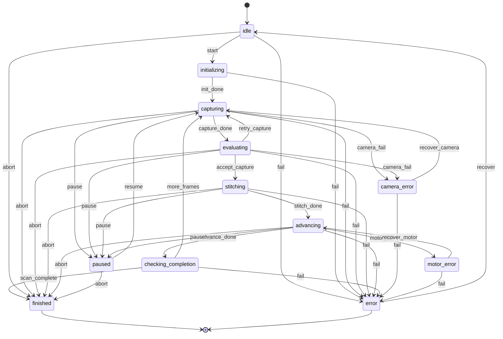

# Neganuki Film Scanner

Modular film‑scanning system built on **Raspberry Pi + IMX477 + manual lens + stepper motor**, designed with a pipeline approach using:

* **Python backend** (independent, headless‑friendly)
* **gRPC** for communication
* **State machine** using `transitions`
* **Stepper control** for advancing film
* **Optional UIs**: local screen on the Pi, mobile/remote UI, or keyboard‑only operation
* **Poetry** for dependency and environment management

---

## Project Structure

```
neganuki/
│
├── backend/
│   ├── camera/              # Camera control (IMX477 with Picamera2)
│   │   ├── __init__.py
│   │   └── imx477.py
│   ├── motor/               # Stepper motor control (28BYJ-48)
│   │   ├── __init__.py
│   │   └── stepper.py
│   ├── fsm/                 # Finite State Machine (transitions)
│   │   ├── __init__.py
│   │   ├── scanner_fsm.py
│   │   └── states.yaml
│   ├── grpc/                # gRPC service
│   │   ├── __init__.py
│   │   ├── server.py
│   │   ├── scanner.proto
│   │   ├── codegen.py
│   │   └── generated/
│   ├── pipeline/            # Core scanning pipeline
│   │   ├── __init__.py
│   │   ├── controller.py    # Main orchestrator
│   │   ├── evaluator.py     # Frame quality & overlap analysis
│   │   ├── stitcher.py      # Image stitching
│   │   └── crop.py          # Frame cropping
│   └── utils/               # Helpers
│
├── client/                  # UI clients (web / mobile / terminal)
│
├── pyproject.toml           # Poetry configuration
└── README.md
```

---

## Installing and Using Poetry to Handle Python Dependencies

### 1. Install Poetry

```bash
curl -sSL https://install.python-poetry.org | python3 -
```

Verify installation:

```bash
poetry --version
```

### 2. Install Project Dependencies

At the project root:

```bash
poetry install
```

This creates a virtual environment and installs all dependencies including:
- `picamera2` - IMX477 camera control
- `rpi-lgpio` - GPIO control for Raspberry Pi
- `opencv-python` - Image processing
- `transitions` - State machine
- `grpcio` & `grpcio-tools` - gRPC communication
- `rawpy`, `tifffile` - RAW image handling
- `loguru` - Logging

### 3. Activate the Virtual Environment

```bash
poetry shell
```

Or run commands inside it without activating:

```bash
poetry run python backend/grpc/server.py
```

### 4. Adding Dependencies

Example:

```bash
poetry add package-name
```

For optional dependencies:

```bash
poetry install --extras "camera gpio"
```

---

## Generating gRPC Code

Generate Python stubs from proto files:

```bash
poetry run python -m grpc_tools.protoc \
  -I./backend/grpc \
  --python_out=./backend/grpc/generated \
  --grpc_python_out=./backend/grpc/generated \
  ./backend/grpc/scanner.proto
```

Or use the built-in script:

```bash
poetry run generate-protos
```

---

## Running the Backend

Start the gRPC server:

```bash
poetry run python backend/grpc/server.py
```

The server will start on `localhost:50051` by default.

---

## Running the Client UI

### Graphical User Interface (Tkinter)

The GUI client provides a complete interface with scan controls, live preview, and status monitoring.

#### Installation

Ensure Pillow is installed for image handling:

```bash
poetry add Pillow
```

#### Running the GUI

```bash
poetry run python client/neganuki-ui/scanner_gui.py
```

Or from within the poetry shell:

```bash
poetry shell
cd client/neganuki-ui
python scanner_gui.py
```

#### GUI Features

- **Connection Management** - Connect to scanner with host/port configuration
- **Scan Controls** - Start, pause, resume, and stop scanning operations
- **Frame Capture** - Capture single RGB or RAW frames
- **Live Preview** - Real-time camera preview when scanner is idle (10 FPS)
- **Status Monitoring** - Auto-refresh status with frame count and state tracking
- **Preview Display** - View captured frames and live camera feed
- **Status Log** - Scrollable log with timestamps and color-coded messages

#### Quick Start

1. Start the backend server (in one terminal):
   ```bash
   poetry run python backend/grpc/server.py
   ```

2. Start the GUI client (in another terminal):
   ```bash
   poetry run python client/neganuki-ui/scanner_gui.py
   ```

3. In the GUI:
   - Enter host: `localhost` (or Pi IP address if remote)
   - Enter port: `50051`
   - Click **Connect**
   - Check **Live Preview** to see camera feed (when idle)
   - Click **Start Scan** to begin scanning

### Command-Line Clients

#### Interactive Menu Client

Terminal-based menu interface:

```bash
poetry run python client/raspberry-pi/interactive_scanner.py
```

Features: Interactive menu, status display, pause/resume control, frame capture

#### Simple Script Client

Automation-friendly script:

```bash
# Quick scan
poetry run python client/raspberry-pi/simple_scan.py --quick-scan

# Capture test frame
poetry run python client/raspberry-pi/simple_scan.py --capture

# Monitor scan
poetry run python client/raspberry-pi/simple_scan.py --monitor
```

#### Programmatic Client Library

Use the client library in your own scripts:

```python
from client.raspberry_pi.scanner_client import ScannerClient

client = ScannerClient()
client.connect("localhost:50051")

# Start scanning
client.start_scan()

# Monitor progress
for state, frame_count in client.stream_status():
    print(f"State: {state}, Frames: {frame_count}")
    if state == "finished":
        break

client.shutdown()
```

---

## Hardware Setup

### Required Components

- **Raspberry Pi 3B** (or newer) running Raspberry Pi OS Bookworm
- **IMX477 Camera Module** (12MP, HQ Camera)
- **28BYJ-48 Stepper Motor** with ULN2003 driver
- **Manual lens** compatible with IMX477 (C/CS mount)

### GPIO Pin Configuration

Default stepper motor pins (configurable):
- IN1: GPIO 17
- IN2: GPIO 18
- IN3: GPIO 27
- IN4: GPIO 22

### Permissions

Add your user to the GPIO group:

```bash
sudo usermod -aG gpio $USER
```

---

## State Machine

The scanner uses a finite state machine with the following states:

### States
- **idle** - Waiting to start
- **initializing** - Setting up camera and motor
- **capturing** - Taking a photo
- **evaluating** - Checking frame quality
- **stitching** - Combining frames
- **advancing** - Moving film forward
- **checking_completion** - Deciding if scan is done
- **paused** - Scan temporarily stopped
- **finished** - Scan completed successfully
- **error** - General error state
- **camera_error** - Camera-specific error (with recovery)
- **motor_error** - Motor-specific error (with recovery)

### Transitions
- `start` - Begin scanning
- `pause` / `resume` - Pause and resume operations
- `retry_capture` - Retry if frame quality is poor
- `fail` - Enter error state
- `recover_camera` / `recover_motor` - Automatic recovery from errors
- `abort` - Emergency stop

---

## gRPC API

### Available RPCs

#### StartCapture
Start the scanning pipeline.

```python
stub.StartCapture(scanner_pb2.CaptureRequest())
```

#### GetStatus
Get current FSM state and frame count.

```python
status = stub.GetStatus(scanner_pb2.StatusRequest())
print(f"State: {status.state}, Frames: {status.frame_count}")
```

#### PauseScan / ResumeScan
Pause or resume the current scan.

```python
stub.PauseScan(scanner_pb2.PauseRequest())
stub.ResumeScan(scanner_pb2.ResumeRequest())
```

#### CaptureFrame
Capture a single frame (bypass FSM).

```python
# Preview frame
response = stub.CaptureFrame(scanner_pb2.FrameCaptureRequest(raw=False))

# RAW frame
response = stub.CaptureFrame(scanner_pb2.FrameCaptureRequest(raw=True))
```

#### StreamStatus
Real-time status updates via server streaming.

```python
for update in stub.StreamStatus(scanner_pb2.StatusRequest()):
    print(f"State: {update.state}, Frames: {update.frame_count}")
```

#### Shutdown
Stop scanning and cleanup resources.

```python
stub.Shutdown(scanner_pb2.ShutdownRequest())
```

---

## Configuration

### Camera Settings

Configure in `PipelineController`:

```python
camera_config = {
    'resolution': (4056, 3040),  # IMX477 full resolution
}

controller = PipelineController(
    output_dir="./output",
    camera_config=camera_config,
    max_frames=100,
    detect_film_end=True
)
```

### Motor Settings

```python
motor_pins = {
    'pins': (17, 18, 27, 22),  # GPIO pins
    'delay': 0.002              # Step delay in seconds
}

controller = PipelineController(
    output_dir="./output",
    motor_pins=motor_pins
)
```

### Frame Quality Thresholds

Adjust in `CaptureEvaluator`:

```python
evaluator = CaptureEvaluator(
    sharpness_threshold=100.0,   # Laplacian variance
    brightness_min=30.0,          # Min acceptable brightness
    brightness_max=225.0,         # Max acceptable brightness
)
```

---

## Features

### Automatic Quality Control
- **Sharpness detection** - Rejects blurry frames
- **Exposure validation** - Detects over/underexposed frames
- **Retry mechanism** - Up to 3 retries per frame

### Film End Detection
- **Dark frame detection** - Identifies end of film
- **Edge density analysis** - Detects blank leader/trailer
- **Frame count limit** - Prevents runaway scanning

### Error Recovery
- **Camera errors** - Automatic reinitialization
- **Motor errors** - GPIO reset and recovery
- **Graceful degradation** - Continues when possible

### Image Stitching
- **Feature-based alignment** - ORB or SIFT descriptors
- **Homography transformation** - Accurate frame alignment
- **Automatic blending** - Seamless mosaic creation

---

## Development Setup

### Semantic Commits

This project uses [Conventional Commits](https://www.conventionalcommits.org/) for consistent commit messages and automatic versioning.

#### Quick Setup

```bash
# Install development dependencies
poetry install --with dev

# Install pre-commit hooks
poetry run pre-commit install
poetry run pre-commit install --hook-type commit-msg
```

#### Usage

```bash
# Interactive commit (recommended)
git add .
poetry run cz commit

# Manual commit (validated by pre-commit hook)
git commit -m "feat(camera): add live preview streaming"
```

#### Version Bumping

```bash
# Automatic version bump and changelog generation
poetry run cz bump

# Push with tags
git push --follow-tags origin main
```

For detailed instructions, see [docs/semantic-commits/](docs/semantic-commits/) and [CONTRIBUTING.md](CONTRIBUTING.md).

---

## Optional: Generate `requirements.txt`

Useful for users who don’t use Poetry:

```
poetry export -f requirements.txt --output requirements.txt --without-hashes
```

---

## Notes

* The backend is designed to run headless (no UI required)
* Control everything via gRPC from any client
* The pipeline is modular and extensible
* Built for Raspberry Pi OS Bookworm with `rpi-lgpio`
* Supports both preview (RGB) and RAW (Bayer) capture modes
* State machine configuration in YAML for easy customization
* Automatic error recovery for camera and motor failures

---

## State Machine Diagram



---

## Troubleshooting

### Camera not detected
```bash
# Check if camera is connected
vcgencmd get_camera

# Test with libcamera
libcamera-hello
```

### GPIO permission errors
```bash
# Add user to gpio group
sudo usermod -aG gpio $USER

# Reboot required
sudo reboot
```

### Import errors
```bash
# Ensure virtual environment is activated
poetry shell

# Reinstall dependencies
poetry install --sync
```

### gRPC connection refused
```bash
# Check if server is running
poetry run python backend/grpc/server.py

# Verify port is not in use
netstat -tuln | grep 50051
```